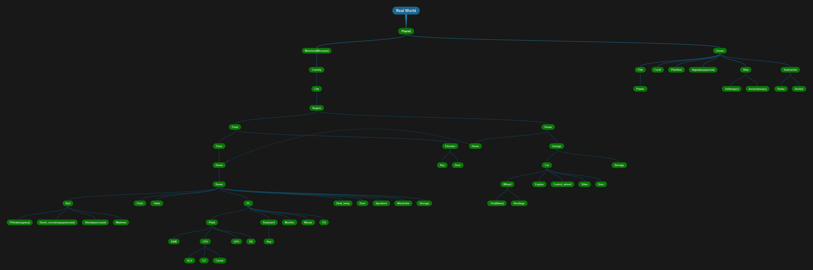

## How add project classes in your project objects

1. Add connect.js in your .html file.
2. Create .js file where you can use this objects

## How to use objects
This is a hierarchy map.

1. All objects are in a hierarchy
2. To create an object, you first need to create its internal objects

All objects list

- Algae()
- ALU()
- Bed(Pillow, Mattres, Sheet, Duvet_cover)
- Pillow()
- Mattres()
- Sheet()
- Bondage()
- CPU(ALU, CU, Cache)
- Wheel()
- Sitter()
- Car(firm_name, Engine, Wheel[], Control_wheel, Sitter[], Door[])
- Chair()
- City(city_name)
- Region(region_name)
- Control_wheel()
- Coral()
- Desk_lump()
- Duvet_cover()
- Elevator(door, keys[])
- Door()
- Engine()
- Fish()
- Floor(Home[])
- Float(Floor[], Elevator)
- GPU(RAM)
- HD(size) // hard disk
- Storage()
- Garage(Storage)
- Home(room_count)
- House(Home, Garage)
- Room()
- Plata(RAM, CPU, HD, GPU = null)
- RAM(size)
- CU()
- Cache()
- Key(key_name)
- Keyboard(Key[])
- PC(Plata, Keyboard, Monitor, mouse, OS)
- Monitor(width, height)
- Mouse()
- OS(OS_name)
- Ship(Sail, Anchor)
- Table()
- Sail()
- Anchor()
- Submarine(Radar, Rocket)
- Radar()
- Rocket()
- Ocean(ocean_name)
- Mainland(mainland_name)
- Planet(palnet_name, Mainland[], Ocean[])
- Country(country_name)
- People(name, surname, age, from_country)
- Speakers()
- Tire()
- Wardrobe()